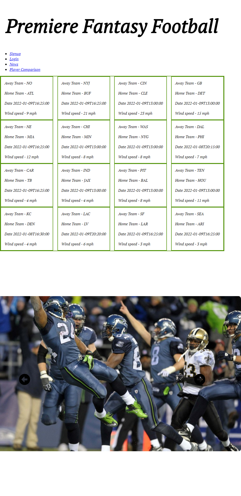

<h1 align='center'> Premiere Fantasy Football 🏈</h1>
  

  
  
  

    
    
    

     
  ## Description 📋
   Welcome to Premiere Fantasy Football! This app features daily NFL news, schedules, and fantasy results - designed as a one-stop-shop for NFL football fans!
   
   🔗Heroku Deployed Link: https://fantasy-football-1.herokuapp.com/

   📸 Screenshot
   

  ## Table of Contents 🗃️
  - [Description](#description)
  - [Installation](#installation)
  - [Contributing](#contributing)
  - [GitHub](#github)
  - [Questions](#questions)

  ## Installation 🕹️
  Checkout the Heroku link above! ⬆️

  Otherwise, clone the repo then run the following commands to run the app locally. 

  `npm install`

  `cd client`

  `npm start`

  ## Contributing 👨‍💻
  Calvin Donner

  Tyler Sundquist

  Mitchell Lyon

  ## GitHub :octocat:
  [Calvin Donner](https://github.com/calvinjdonner)

  [Tyler Sundquist]()

  [Mitchell Lyon]()

  ## Questions ❓
  Reach out to any of our talented team members with questions! 
   
 